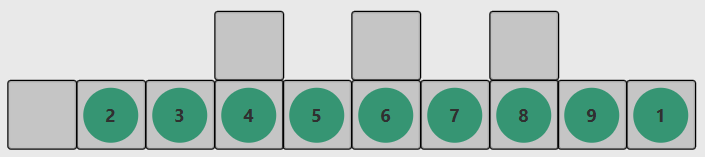

Tile-Slider F2/17

Kilenc darab számozott lapocskát helyezünk el.
Minden egyes korongot el lehet tolni egy négyszomszédos üres pozícióra. Fel-
adatunk a korongok sorrendbe rendezése: az 1-es számút eljuttatni a legbalol-
dalibb pozícióra, miközben az összes többi lapocskát visszajuttatjuk eredeti
helyére.